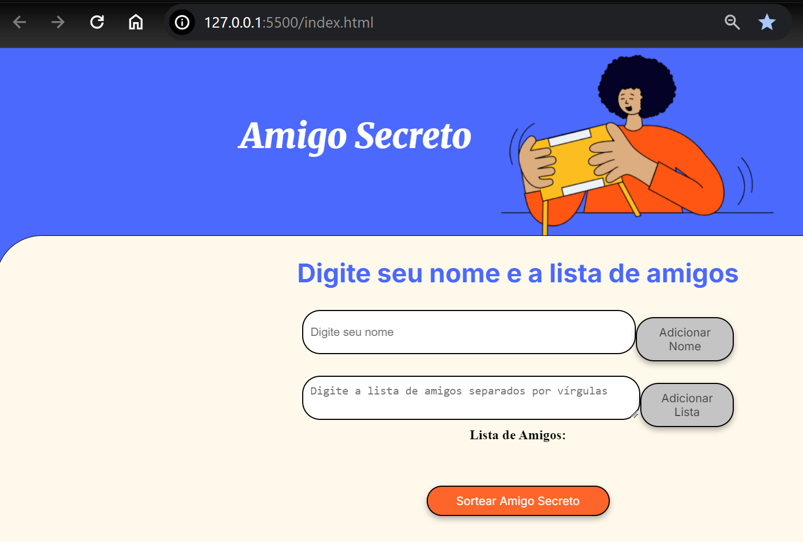

# 🎁 Jogo do Amigo Secreto

Bem-vindo ao **Jogo do Amigo Secreto**! Este é um projeto divertido e interativo para sortear amigos secretos de forma justa e dinâmica. Com um design intuitivo e funcionalidades especiais, seu sorteio ficará ainda mais emocionante! 🎉

## 🚀 Funcionalidades

✅ **Sorteio Justo:** Garante que ninguém tire a si mesmo no sorteio.\
✅ **Lista Personalizada:** Adicione os participantes de forma simples e prática.\
✅ **Sistema de Tentativas:** Caso um participante sorteie um familiar próximo (esposo, esposa ou filho), poderá ter até 3 tentativas para um novo sorteio.\
✅ **Compartilhamento Fácil:** Gere um link exclusivo para compartilhar com os participantes e revelar os sorteios.\
✅ **Interface Amigável:** Design bonito e responsivo para qualquer dispositivo.

## 🎮 Como Jogar

1️⃣ Digite o seu nome e a lista de amigos que irão participar.\
2️⃣ Clique no botão **"Sortear Amigo Secreto"**.\
3️⃣ O sistema escolherá um nome aleatoriamente (que não seja o seu).\
4️⃣ Se você tirou seu filho, esposo ou esposa, terá a opção de tentar novamente até 3 vezes.\
5️⃣ Compartilhe o resultado com os amigos!

## 📸 Capturas de Tela


## 🛠️ Tecnologias Utilizadas

- **HTML5** → Estrutura da página.
- **CSS3** → Estilização e responsividade.
- **JavaScript** → Lógica do sorteio e interatividade.

## 📂 Como Executar o Projeto

1️⃣ Clone este repositório:

```bash
 git clone https://github.com/seu-usuario/jogo-amigo-secreto.git
```

2️⃣ Acesse a pasta do projeto:

```bash
 cd jogo-amigo-secreto
```

3️⃣ Abra o arquivo **index.html** no seu navegador preferido! 🚀

## 🔗 Demonstração Online

(https://amigo-secreto-six-olive.vercel.app/)

## 📌 Contribuições

Sinta-se à vontade para contribuir! Caso tenha sugestões, abra uma **Issue** ou faça um **Pull Request**. 💡✨

---

Feito com ❤️ por [Kassya Rayanny](https://github.com/seu-usuario)

